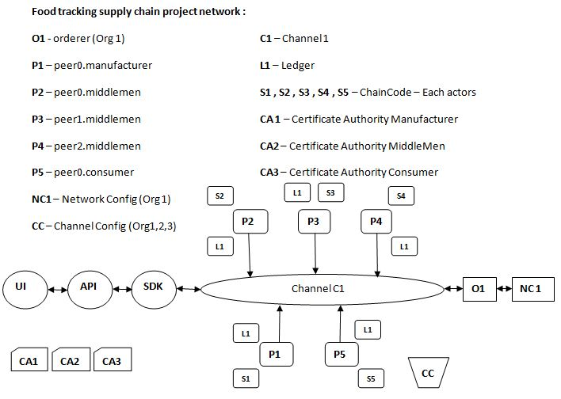

# supplychain-hyperledger-fabric


[](https://github.com/Kaushikgopuu/supplychain-hyperledger-fabric/actions/workflows/ci.yml)

A blockchain-based supply chain management system built on Hyperledger Fabric to ensure transparency, traceability, and authenticity of products. Supports role-based access for manufacturers, wholesalers, distributors, retailers, and consumers with chaincode in Go and a React.js frontend.

## Objective

Traditional supply chains lack transparency and interoperability, making it hard to trace products end-to-end. Blockchain offers a transparent, immutable, and secure foundation to improve:

- Tracking products across the chain
- Verifying and authenticating products
- Sharing information between actors
- Auditability

## Use cases

- Farm to fork tracking
- Diamond tracking
- High-value goods (leather goods, watches, dresses, etc.)

## Components

- Frontend: React.js
- Middleware APIs: Node.js/Express
- SDK: Node.js
- Network: Hyperledger Fabric
- Chaincode: Go

## Users

- Manufacturer
- Wholesaler
- Distributor
- Retailer
- Consumer

## Architecture



## Application flow

- Admin enrolls users
- Manufacturer creates products
- Product flows Manufacturer → Wholesaler → Distributor → Retailer
- Consumer places order and marks delivered once received

## Fabric network details

- 3 Orgs (Manufacturer/MiddleMen/Consumer)
- 5 peers, 1 Orderer (Org1), 1 Channel
- 3 Certificate Authorities
- Uses Fabric CA for identity management

## Chaincode functions (summary)

- createUser, signIn
- createProduct, updateProduct
- sendToWholesaler, sendToDistributor, sendToRetailer
- sellToConsumer, orderProduct, deliveredProduct
- queryAsset, queryAll

## Planned APIs (summary)

- User SignIn
- createProduct, updateProduct
- sendToWholesaler, sendToDistributor, sendToRetailer
- sellToCustomer
- Email notifications (planned)

## Quick start: API server

```bash
cd web-app/servers
npm install
npm run start
```

Dev mode env flags you can use:

- DEV_FAKE_STORAGE=true
- ALLOW_DEV_LOGIN=true
- SKIP_FABRIC_ENROLL=true
- SERVE_CLIENT=true (to serve the React build from Express)

## How to run (development)

Run backend and frontend separately for fast dev feedback.

```bash
# 1) Backend (API only on port 8090)
cd web-app/servers
npm install
DEV_FAKE_STORAGE=true ALLOW_DEV_LOGIN=true SKIP_FABRIC_ENROLL=true SERVE_CLIENT=false PORT=8090 npm start

# In a new terminal
# 2) Frontend (React dev server on port 3000)
cd web-app/client
npm install
BROWSER=none PORT=3000 npm start
```

- API: http://localhost:8090/health
- UI: http://localhost:3000/
- Inspect data: http://localhost:8090/__devdump and http://localhost:8090/__db

## How to run (single-port, serve React from Express)

Build the React app then serve it from Express at the same port.

```bash
# Build UI
cd web-app/client
npm install
npm run build

# Serve UI via Express on port 8090
cd ../servers
SERVE_CLIENT=true DEV_FAKE_STORAGE=true ALLOW_DEV_LOGIN=true SKIP_FABRIC_ENROLL=true PORT=8090 npm start
```

- Visit UI: http://localhost:8090/
- API health: http://localhost:8090/health
- Data inspectors: http://localhost:8090/__devdump and http://localhost:8090/__db

## Bring up the Fabric network (scripts)

```bash
sudo docker ps --all
./stopNetwork.sh
./teardown.sh
./operate.sh up
```

## Bring up the Fabric network (manual outline)

1) Generate crypto material and channel artifacts (see artifacts/*)
2) Export FABRIC_CFG_PATH to artifacts
3) Generate genesis.block and channel.tx
4) Start network with docker-compose (artifacts/docker-compose.yaml)
5) Create/join channel and update anchor peers
6) Install/instantiate chaincode (supplychaincc)
7) Invoke/query functions as needed

Refer to the detailed commands in the original docs if you need a fully scripted setup.

## Development notes

- Dev data stored in `web-app/servers/.devdata.json`
- Audit DB (LowDB) in `web-app/servers/db.json`
- Inspect endpoints when server is running:
    - `GET /__devdump` (dev store)
    - `GET /__db` (audit summary)

Tip: LAN access

If you want to open the dev server to your LAN, start with `HOST=0.0.0.0` (React) or bind Express to `0.0.0.0`. Then access via your machine IP, e.g. `http://192.168.x.x:3000`.

## Contributing

Contributions are welcome! To propose changes:

1. Fork the repo and create a new branch: `git checkout -b feat/your-feature`
2. Make your changes with clear commits
3. Run and verify locally (see How to run)
4. Push your branch and open a Pull Request to `main`
5. Describe the change, screenshots (if UI), and testing steps

For small fixes, feel free to open an issue or PR directly.

